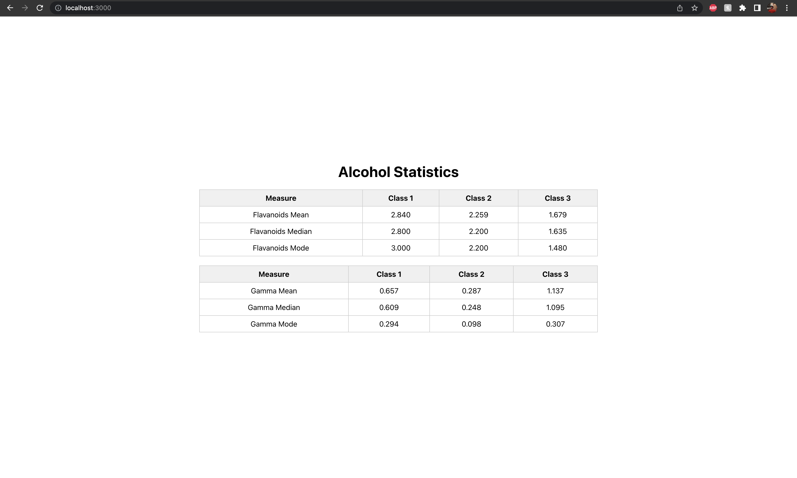

# Statistical measure of Wine data set app

This project was bootstrapped with [Create React App](https://github.com/facebook/create-react-app).

## Available Scripts

In the project directory, you can run:

### `yarn start`

Runs the app in the development mode.\
Open [http://localhost:3000](http://localhost:3000) to view it in your browser.

The page will reload when you make changes.\
You may also see any lint errors in the console.

## Screenshot

## Project structure

Inside the root folder, there is a `src` folder. The main App component is `App.js` and the styles are in `App.css`. The JSON data is located in `AlcoholData.js` file.